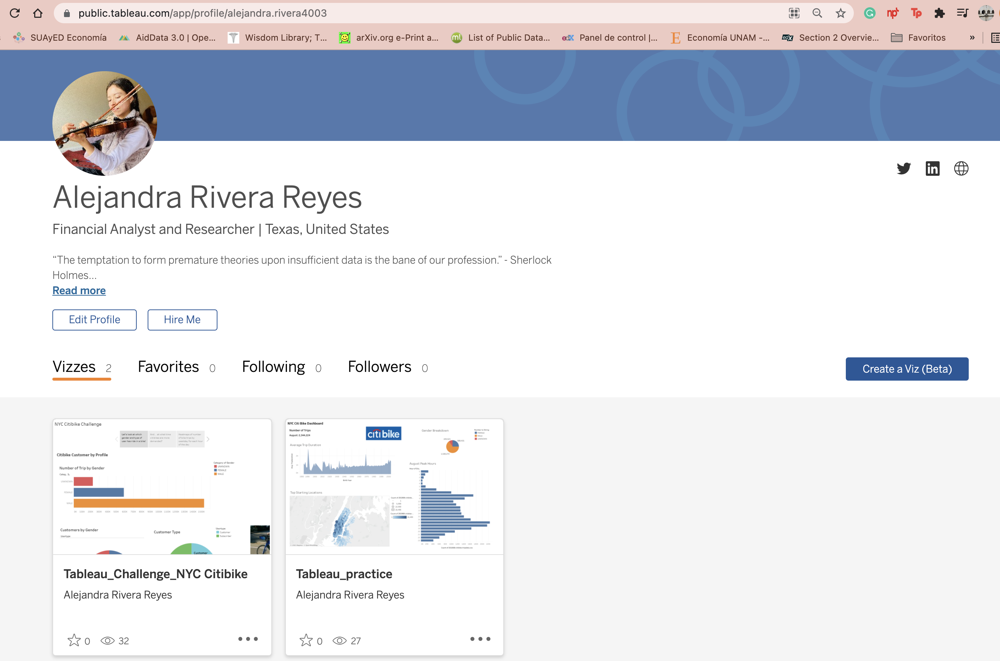

# **Bike-sharing data -Citibike- :biking_woman:
## NYC Project :bicyclist:

Using [Tableau Public](https://public.tableau.com/en-us/s/), the project was based on open source data, specifically New York City—Des Moines Citi Bike data, where downloaded history about trips and rides. [Citi Bike System Data page](https://ride.citibikenyc.com/system-data). The zip file used is `201908-citibike-tripdata.csv.zip`, that later on was set up in the Tableau environment.

Data Source Citibike

## ***Overview of Project :biking_man:

The data source is a flat file .CSV, it did not needed any join for the analysis purposes. Additionally, the visualizations were created in form of worksheets, as well as we applied some dashboards and stories. Finally, the project includes a creation of a `calculated field` which essentially allows us to write code to customize our data.

Description of each component:
- Worksheets are the building blocks of our visualizations from which we are able to create dashboards and stories. A worksheet is made up of a single graph or plot, which we will learn how to create later on. Worksheets are customizable, but require almost no actual code.
- Dashboards are a collection of worksheets formatted to present data in a way that is easy to read.
- Stories are simply Tableau dashboards that include narration of what is occurring with the data.

The introdution of my project is located in the `Tableau Public` website [My Profile](https://public.tableau.com/app/profile/alejandra.rivera4003)

My TableauPublic portal

## ***Results :mountain_bicyclist:

For the analysis, it is use Pandas to change the "tripduration" column from an integer to a datetime datatype. Then, using the converted datatype, you’ll create a set of visualizations to:

1. Show the length of time that bikes are checked out for all riders and genders.
2. Show the number of bike trips for all riders and genders for each hour of each day of the week.
3. Show the number of bike trips for each type of user and gender for each day of the week.

Deliverable 1: The data in the "tripduration" column is converted to a datetime datatype and has the correct time format.
Deliverable 2: Create Visualizations for the Trip Analysis

->Checkout Times

->Trips by Weekday for Each Hour

## ***Summary :mountain_biking_woman:

The finders for August 2019 citibike data are:

- CitiBike Analysis tells that more than 80% are Subscribers, with an ~19% or regular non-subscribers, that data creates a new need, such better user experiance interaction in the future.
- CitiBike Analysis tells that 65.2% of the population are men, 25.1% are women, and 9.6% is unknown.
- CitiBike Analysis says that the top trips by using a bike is less than an hour, and the schedules are: @8:00AM and between 5-6PM.

